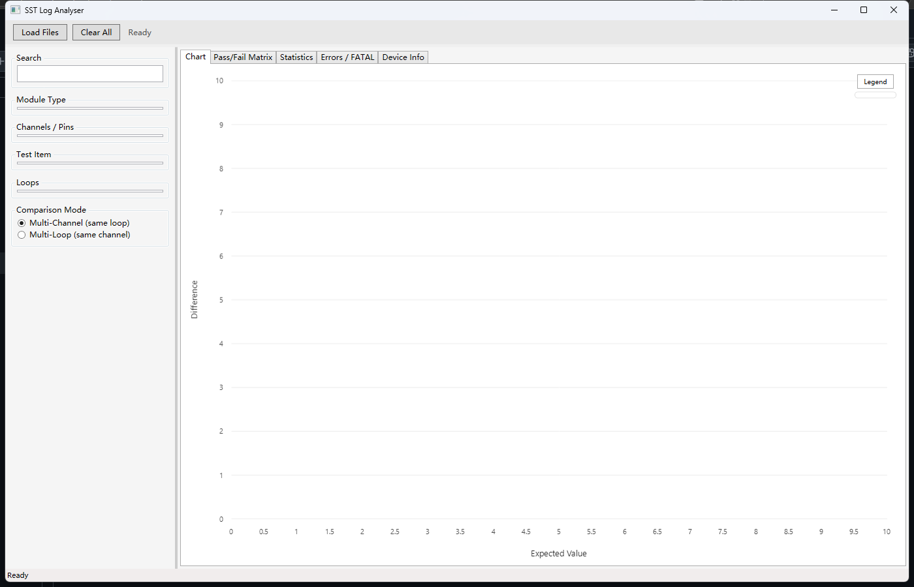

# SST Log Analyser 使用手册

## 目录

1. [简介](#简介)
2. [安装与启动](#安装与启动)
3. [加载日志文件](#加载日志文件)
4. [数据过滤与筛选](#数据过滤与筛选)
5. [图表查看](#图表查看)
6. [Diagnostics 诊断](#diagnostics-诊断)
7. [数据标签页](#数据标签页)
8. [MIXI 模块说明](#mixi-模块说明)
9. [图表与表格联动](#图表与表格联动)
10. [标签页浮窗](#标签页浮窗)
11. [多文件对比](#多文件对比)
12. [常见问题](#常见问题)

---

## 简介

SST Log Analyser 是一款用于解析和可视化半导体测试日志文件的桌面工具。主要功能：

- **智能解析** — 自动识别测试数据、设备信息、错误日志
- **本地缓存** — 解析结果存入 SQLite，重复加载秒开
- **交互式图表** — 实时缩放、自定义图例、悬停查看数据点
- **多维度对比** — 按通道、循环、文件进行数据对比分析
- **校准诊断** — 从容差、校准系数、残差和正负路径对称性定位异常
- **拖放加载** — 支持直接拖拽多个日志文件到窗口

### 支持的日志格式

- Adaptstar Service Tool 生成的 `.txt` 日志
- 包含校准数据、设备映射、系统信息、错误日志的标准化格式

---

## 安装与启动

### 环境要求

- Windows 10/11 x64
- 使用官方 MSI 安装包时，无需预先安装 .NET Runtime

### 安装（推荐）

1. 从 GitHub Releases 下载 `SSTLogAnalyser-v1.2.1-win-x64.msi` 和对应的 `.sha256` 文件。
2. 双击 MSI，在 **Destination Folder** 页面保留默认目录或点击 **Browse** 选择其他安装路径，然后完成安装。
3. 从桌面快捷方式或开始菜单启动 **SST Log Analyser**。

默认安装目录是 `%LOCALAPPDATA%\Programs\SST Log Analyser`，使用该位置不需要管理员权限。也可以选择其他当前账号有写权限的目录；请勿选择 `Program Files` 等受保护位置，否则安装可能因权限不足而失败。安装包已经包含 .NET 9 Windows Desktop Runtime，即使电脑没有安装 .NET 也能直接运行。

> 当前安装包未进行商业代码签名。如果 Windows SmartScreen 弹出提示，请确认文件来自本项目的官方 GitHub Release，并使用 `.sha256` 文件核对哈希后再选择运行。

### 升级与卸载

- **升级：** 关闭正在运行的程序，直接运行新版本 MSI。安装程序会自动替换旧版本。
- **卸载：** 打开 Windows **设置 → 应用 → 已安装的应用**，找到 **SST Log Analyser** 并选择卸载。
- 升级和卸载不会删除 `%LOCALAPPDATA%\SSTLogAnalyser\cache.db`，因此已有 LOG 缓存可以继续使用；如需完全清理，可手动删除该目录。

### 启动方式

普通用户请从桌面或开始菜单快捷方式启动。开发者也可以从源码运行：

```powershell
dotnet build
dotnet run
```

首次启动会自动创建本地数据库：`%LOCALAPPDATA%\SSTLogAnalyser\cache.db`

### 主界面布局



**界面区域说明：**

```
┌─────────────────────────────────────────────────────────────┐
│ 工具栏：[Load Files] [Clear All]          状态栏/进度条      │
├─────────────────────────────────────────────────────────────┤
│ 已加载文件列表（芯片图标显示文件名和循环数）                   │
├──────────┬──────────────────────────────────────────────────┤
│          │                                                  │
│  过滤    │              数据标签页                           │
│  面板    │  ┌──────────────────────────────────────────┐    │
│          │  │ Chart │ Pass/Fail │ Data │ Stats │ Errors │ Dev │
│ · 搜索   │  │                                          │    │
│ · 模块   │  │         （当前选中标签页内容）              │    │
│ · 通道   │  │                                          │    │
│ · 测试项 │  │                                          │    │
│ · 循环   │  │                                          │    │
│ · 对比模式│  │                                          │    │
│          │  └──────────────────────────────────────────┘    │
└──────────┴──────────────────────────────────────────────────┘
```

---

## 加载日志文件

### 方式一：点击按钮

1. 点击工具栏 **[Load Files]** 按钮
2. 在文件选择对话框中选择一个或多个 `.txt` 日志文件
3. 点击 **打开**，程序开始解析

### 方式二：拖放加载（推荐）

1. 在文件资源管理器中选中一个或多个日志文件
2. 直接拖放到 SST Log Analyser 窗口内
3. 释放鼠标，程序自动开始解析

### 解析过程

```
┌─────────────────────────────────────────┐
│  用户拖入文件                            │
│       ↓                                 │
│  计算文件 SHA256 哈希                    │
│       ↓                                 │
│  查询缓存数据库                          │
│       ↓                                 │
│  ┌────┴────┐                            │
│  ↓         ↓                            │
│ 命中       未命中                        │
│  │         │                            │
│  │    解析文件内容                       │
│  │    (正则提取各类数据)                │
│  │         │                            │
│  │    写入缓存数据库                    │
│  │         │                            │
│  ←─────────┘                            │
│       ↓                                 │
│  更新界面：文件列表、过滤器、图表        │
└─────────────────────────────────────────┘
```

**进度显示：**
- 状态栏显示当前处理文件名
- 进度条显示解析百分比
- 完成后显示提取的数据点数量

**缓存机制：**
- 相同内容的文件（SHA256 相同）只解析一次
- 再次加载时直接从缓存读取，速度提升 10-100 倍
- 缓存文件位置：`%LOCALAPPDATA%\SSTLogAnalyser\cache.db`

### 解析提取的数据类型

| 数据类型 | 提取内容 | 用途 |
|---------|---------|------|
| 测试数据 | Expected/Measured/Difference/Limits | 图表绘制、统计分析 |
| 设备信息 | Group/Location/Slot/DeviceName | Device Info 标签页 |
| 系统信息 | 版本号、温度、时钟频率 | Device Info 标签页 |
| 错误日志 | ERROR/FATAL 行及时间戳 | Errors 标签页 |
| 文件元数据 | 工具版本、循环数、模块类型 | 文件列表显示 |

---

## 数据过滤与筛选

左侧过滤面板用于缩小数据范围，聚焦关注的测试项。

### 过滤器层级

```
Module Type（模块类型）
    ↓
Channel / Pins（通道号）
    ↓
Test Item（测试项目名称）
    ↓
Loop Index（循环序号）
```

### 各过滤器说明

#### Search（搜索）

在测试项名称中搜索关键词，支持部分匹配。

**示例：**
- 输入 `voltage` → 匹配所有包含 "voltage" 的测试项
- 输入 `cal` → 匹配 "Calibration", "Recal" 等

#### Module Type（模块类型）

选择要查看的模块类型。不同模块的测试数据独立存储。

**常见模块类型：**
- `DPS` — Device Power Supply
- `PMU` — Parametric Measurement Unit
- `PPMU` — Per-Pin PMU，支持 FV/MV、FI/MI、VCH、VCL
- `PE` — Pin Electronics
- `DPSI` — DPS Interface
- `MIXI` — AWG/DTZ 混合信号校准

#### Channels / Pins（通道号）

选择具体的通道。支持多选（按住 Ctrl 或 Shift）。

**提示：**
- 点击 **ALL** 会清除列表选择，并显示所有通道。
- 通道数量较多时，使用 ALL 右侧的上一页/下一页按钮可一次选择 128 个 Channel；旁边会显示当前范围和总数，例如 `129-256 / 2048`。
- 切换通道时，如果原 Test Item 在新选择中仍然有效，程序会保留该 Test Item，无需重复选择。

#### Test Item（测试项目）

选择具体的测试项目。列表会根据已选模块自动更新。

**示例：**
- `V, -3, 8, Force Voltage` — 强制电压测试
- `I, 10uA, Measure Current` — 电流测量测试
- `Offset Calibration` — 偏移校准

#### Loops（循环序号）

选择要查看的循环，支持 Ctrl 或 Shift 多选。`0` 通常表示初始值（Initial），`1, 2, 3...` 表示后续循环；点击 **ALL** 可显示所有 Loop。

#### Comparison Mode（对比模式）

| 模式 | 分组方式 | 适用场景 |
|-----|---------|---------|
| **Multi-Channel** | 同一循环，跨通道对比 | 检查通道间一致性 |
| **Multi-Loop** | 同一通道，跨循环对比 | 追踪校准漂移趋势 |

**模式默认行为：**

- 切换到 **Multi-Channel** 时，Channel 自动设为 ALL，并默认选择第一个 Loop，避免多个 Loop 意外叠加。
- 切换到 **Multi-Loop** 时，Loop 自动设为 ALL，并默认选择第一个 Channel，避免多个 Channel 意外叠加。
- Channel 和 Loop 同时为 ALL 时，每个 `Channel / Loop` 组合保持为独立曲线，不会把同一 Channel 的多个 Loop 合并成一条线。

#### Rendering（渲染）

- 默认显示原始 Channel/Loop 曲线、点标记和失败点。
- 选择 **ALL** 时会绘制当前 Test Item 下全部 Channel/Loop 原始曲线，不再限制为 128 组。
- 勾选 **Performance Mode** 后仍显示全部原始曲线，但关闭点标记、失败点叠加和动画，以提高大量曲线时的响应速度。
- 超过 128 组曲线或 50,000 个点时会自动使用快速渲染，但不会省略 Channel；主图左上角会显示实际绘制的完整曲线数量。
- 绘图数量限制不会删除数据，Data 标签和 Statistics 始终保留完整结果。

### 过滤器的联动关系

```
选择 Module Type
    ↓
自动更新：Channels、Test Items、Loops 列表
    ↓
选择 Test Item
    ↓
自动更新：Loops 列表（进一步筛选）
    ↓
选择 Channels / Loops
    ↓
自动更新：图表、统计数据、Pass/Fail 矩阵
```

---

## 图表查看

Chart 标签页是核心可视化界面，展示校准数据的 Expected vs Difference 关系。

### 图表组成

```
┌─────────────────────────────────────────────────────────┐
│                                                         │
│         ┌─────────────────────────────────┐             │
│         │  [Legend] 按钮（可切换显示）     │             │
│         │  ┌───────────────────────────┐  │             │
│         │  │ ━━ Ch0  (蓝色线)          │  │             │
│         │  │ ━━ Ch1  (绿色线)          │  │             │
│         │  │ ━━ High Limit (红色虚线)  │  │             │
│         │  │ ━━ Low Limit  (蓝色虚线)  │  │             │
│         │  │ ●  Ch0 (Failed) (红点)    │  │             │
│         │  └───────────────────────────┘  │             │
│         │                                 │             │
│         │      ●                          │             │
│         │    ╱   ╲    ●                   │             │
│         │  ╱       ╲╱    ╲                │             │
│         │ ╱                ╲              │             │
│         │━━━━━━━━━━━━━━━━━━━━━━━━━━━━━━━ │             │
│         │        ●                        │             │
│         │                                 │             │
│         └─────────────────────────────────┘             │
│                                                         │
│    Difference                                           │
│         ↑                                               │
│         │                                               │
│         └──────────────────────→ Expected Value         │
│                                                         │
└─────────────────────────────────────────────────────────┘
```

### 系列类型说明

| 系列 | 样式 | 含义 |
|-----|------|------|
| 数据线 | 实线 + 圆点标记 | 每个通道/循环的实际测量差异 |
| High Limit | 红色虚线 | 上限阈值（仅第一组绘制） |
| Low Limit | 蓝色虚线 | 下限阈值（仅第一组绘制） |
| Failed 点 | 红色菱形标记 | 超出限制范围的失败点 |

### 图例控制

**默认状态：** 图例面板显示在右上角，半透明背景。

**操作：**
- 点击 **[Legend]** 按钮 → 切换图例显示/隐藏
- 点击图例中的某个系列 → 只显示该系列，临时隐藏其他数据线
- 点击 **[Show all]** → 恢复显示全部系列
- 图例项目过多时可使用内部滚动条查看和选择后续系列
- 图例隐藏：最大化图表可视区域

### 数据点悬停

鼠标移动到图表上时，会自动查找最近的数据点并显示详细信息：

```
┌─────────────────────┐
│ Ch0                 │  ← 系列名称
│ Expected: -3.0      │  ← 期望值
│ Difference: 8.0e-05 │  ← 实际差异值
└─────────────────────┘
```

**特性：**
- 仅显示最近的一个数据点（不会同时显示多个系列）
- 距离阈值 25 像素，超出范围自动隐藏
- 失败点会标注 `[FAIL]` 后缀

### 图表缩放

- **滚轮缩放：** 鼠标指向需要查看的区域后滚动滚轮，可同时缩放 X/Y 轴
- **平移：** 放大后按住鼠标左键拖动
- **区域缩放：** 按住鼠标右键框选需要放大的区域
- **重置：** 点击图表右上角 **[Reset]** 按钮恢复完整视图

---

## Diagnostics 诊断

Diagnostics 位于 Chart 后面，使用当前 Module、Channel、Test Item 和 Loop 过滤条件生成四张校准诊断图。四张图都支持滚轮缩放；点击标题旁的放大按钮可单独占满诊断区域，再次点击即可恢复四宫格。点击 Diagnostics 标签旁的 **[+]** 可以把整个诊断页弹出为独立窗口。

Diagnostics 只在标签页可见或处于独立浮窗时刷新。Residual 和 POS-NEG 图在数据量较大时只绘制风险最高的 20 组原始曲线；热力图由数据库直接计算每个 Channel/Test Item 的最坏结果，避免加载全部原始行。

### Tolerance Utilization Heatmap（容差利用率热力图）

- 横轴是 Channel，纵轴是 Test Item，每个色块代表该组合在当前文件和 Loop 条件下的最差结果。
- 容差利用率以限制区间中心为基准：越接近 `0%` 越安全，达到 `100%` 表示碰到限制边界，超过 `100%` 表示越界。
- 灰绿色表示余量较大，橙色表示接近限制，红色表示失败或超过容差。
- 顶部摘要中的 `Near limit` 统计 `80%–100%` 的单元格，`Failed` 统计失败单元格，`Worst` 给出最危险的 Channel/Test Item。

### Gain / Offset Distribution（Gain / Offset 分布图）

- 上图展示各 Channel 的 Gain，下图展示 Offset；横线表示当前数据的中位数。
- 下拉框可切换不同校准项。LOG 中的 `M/C` 会自动映射为 `Gain/Offset`，即 `Gain = M`、`Offset = C`。
- 点云整体偏移通常表示系统性系数偏差；单个 Channel 明显脱离点群时，应优先检查该通道的硬件路径或校准过程。

### Residual Signature（残差特征图）

- 横轴是 Expected/Target，纵轴是 Residual/Difference；零线代表没有误差，淡色直线表示每组数据的线性趋势。
- 整体上下偏移通常对应 Offset 问题；随 Target 单调倾斜通常对应 Gain 问题；弯曲或周期形状可能提示非线性或量程相关问题；孤立尖峰更像单点异常。
- 顶部摘要提供 RMS、最大绝对残差及其 Channel、最差容差利用率。比较多条线时，先找明显偏离共同形状的 Channel 或 Loop。

### MIXI / AWG POS-NEG Symmetry Mismatch（正负路径不对称量图）

- 仅在选中包含 POS/NEG 标记的 MIXI/AWG 数据时显示。
- 每个 Channel/Loop 只绘制一条派生曲线：`Mismatch = POS residual - NEG residual`，不再重复显示 Residual Signature 中的原始 POS/NEG 曲线。
- 水平零线表示完全对称；曲线离零线越远，表示该 Target 下的正负路径差异越大，正负号表示偏差方向。
- 摘要中的 `Mean |mismatch|` 和 `Max |mismatch|` 分别表示平均和最大绝对不对称量，并标出最坏 Channel 和 Target。

---

## 数据标签页

其余数据标签页从表格、统计、错误和设备信息等视角展示当前结果。

### Pass/Fail Matrix（通过/失败矩阵）

汇总每个通道 × 测试项的测试结果。

**列说明：**

| 列名 | 含义 |
|-----|------|
| Channel | 通道号 |
| Test Item | 测试项目名称 |
| Total | 总测试次数 |
| Failures | 失败次数（红色高亮 > 0） |

**用途：** 快速定位哪些通道/测试项存在失败情况。

### Statistics（统计数据）

计算每个分组（通道或循环）的描述性统计。

**列说明：**

| 列名 | 含义 |
|-----|------|
| Group | 分组名称（Ch0, Loop 1 等） |
| Count | 数据点数量 |
| Max | 最大差异值 |
| Min | 最小差异值 |
| Mean | 平均差异值 |
| StdDev | 标准差（衡量离散程度） |
| Failures | 失败数量 |

**用途：** 评估校准精度和一致性。标准差越小，数据越集中。

### Errors / FATAL（错误日志）

显示日志文件中所有 ERROR 和 FATAL 级别的日志行。

**列说明：**

| 列名 | 含义 |
|-----|------|
| Loop | 发生错误的循环序号 |
| Time | 时间戳 |
| Level | 错误级别（ERROR / FATAL） |
| Message | 错误消息内容 |
| Line | 在原始日志中的行号 |

**用途：** 排查测试失败原因，定位异常发生的时间点。

### Device Info（设备信息）

分为两个子区域：

#### System Information（系统信息）

| 常见 Key | 含义 |
|---------|------|
| Tool Version | 测试工具版本号 |
| Software Drivers | 驱动程序列表（格式：`名称:版本`） |
| DMM Temperature | 数字万用表温度 |
| System Clock | 系统时钟频率 |
| Operator | 操作员姓名 |
| Tester ID | 测试机编号 |

#### Device Mapping（设备映射）

| 列名 | 含义 |
|-----|------|
| Group | 设备分组号 |
| Location | 位置标识 |
| Slot | 插槽信息 |
| Device | 设备名称 |

**用途：** 确认测试环境的硬件配置和软件版本。

---
## MIXI 模块说明

MIXI 模块包含 AWG 和 DTZ 两个子模块，各自拥有独立的测试项集合。

### 数据含义

| 字段 | MIXI 语义 | 其他模块 |
|------|----------|---------|
| Expected | Target（目标值） | 期望值 |
| Measured | Meas（测量绝对值） | 测量值 |
| Low/High Limit | 对 Meas 的绝对限制 | 对 Difference 的限制 |
| Difference | Meas - Target | 原始差值 |
| Pass/Fail | Meas 超出绝对限制则失败 | Difference 超出限制则失败 |

### 使用建议

1. 选择 MIXI 模块后，**先选中具体通道**，测试项列表会自动过滤为该通道独有的项目
2. AWG 通道的测试项和 DTZ 通道的测试项完全不同，请勿混淆
3. 图表限制线已自动转换到差值坐标系，与数据点在同一 Y 轴尺度上

---

## 图表与表格联动

### Data 标签页

Data 标签页以表格形式展示当前图表中所有原始测试数据，列包括：

| 列名 | 说明 |
|------|------|
| File | 文件 ID |
| Loop | 循环索引 |
| Module | 模块类型 |
| Channel | 通道号 |
| Test Item | 测试项目名称 |
| Expected | 期望值 |
| Measured | 测量值 |
| Difference | 差值 |
| Low Limit | 下限 |
| High Limit | 上限 |
| Failed | 是否失败（失败行高亮为浅红色） |
| Line | 日志文件中的行号 |

### 图表点击 → 表格定位

点击图表中的数据点后：
1. 自动切换到 **Data** 标签页
2. 对应行被选中并滚动到可视区域
3. 方便从图表快速定位到具体数据行

---

## 标签页浮窗

每个标签页标题右侧有一个 **[+]** 按钮，点击可将该标签页内容弹出为独立浮窗。

### 使用方法

1. 点击标签页标题旁的 **[+]** 按钮
2. 内容弹出为独立窗口（900×600）
3. 原标签页显示灰色提示"floating (close window to restore)"
4. **关闭浮窗** → 内容自动恢复到原位

### 注意事项

- 同一标签页只能弹出一个窗口，重复点击会聚焦已有窗口
- 所有 7 个标签页均支持浮窗功能
- 浮窗内的数据绑定与主窗口一致
- 即使 Data 标签被弹出，图表点击仍能正确联动定位

---

## 多文件对比

SST Log Analyser 支持同时加载多个日志文件，进行跨文件的数据对比。

### 加载多个文件

**方式一：一次选择多个文件**
1. 点击 [Load Files]
2. 按住 Ctrl 选择多个文件
3. 点击打开

**方式二：分次拖放**
1. 拖入第一个文件
2. 等待解析完成
3. 拖入第二个文件
4. 文件列表会显示所有已加载的文件

### 多文件分组规则

当加载多个文件时，图表会自动在系列名称前添加文件名前缀：

**单文件模式：**
```
Ch0, Ch1, Ch2, ...
Loop 0, Loop 1, Loop 2, ...
```

**多文件模式：**
```
[FileA] Ch0, [FileA] Ch1, [FileB] Ch0, [FileB] Ch1, ...
[FileA] Loop 0, [FileA] Loop 1, [FileB] Loop 0, ...
```

### 典型应用场景

#### 场景 1：同一设备不同时间的测试对比

```
文件 1: test_2024-01-15.txt  （1 月测试）
文件 2: test_2024-02-20.txt  （2 月测试）

→ 选择 Multi-Loop 模式
→ 查看同一通道在不同循环中的变化趋势
→ 系列名称：[test_2024-01-15] Loop 0, [test_2024-02-20] Loop 0, ...
```

#### 场景 2：不同设备的测试结果对比

```
文件 1: device_A.txt  （设备 A）
文件 2: device_B.txt  （设备 B）

→ 选择 Multi-Channel 模式
→ 对比不同设备在同一测试项上的表现
→ 系列名称：[device_A] Ch0, [device_B] Ch0, ...
```

#### 场景 3：重复性测试验证

```
文件 1-3: 同一测试重复运行 3 次

→ 查看 3 个文件的数据是否一致
→ 如果差异很大，说明测试环境不稳定
```

---

## 常见问题

### Q1: 为什么拖入文件后没有反应？

**可能原因：**
1. 文件格式不支持 — 只支持 Adaptstar 标准格式的 `.txt` 日志
2. 文件太小（< 100KB）— 可能是空文件或格式不完整
3. 文件已被缓存 — 检查文件列表是否已存在该文件

**解决方法：**
- 确认文件是完整的测试日志
- 查看状态栏是否有错误信息
- 清除缓存：删除 `%LOCALAPPDATA%\SSTLogAnalyser\cache.db`

### Q2: 图表显示空白，没有数据？

**可能原因：**
1. 未选择 Module Type — 必须选择模块类型才能显示数据
2. 未选择 Test Item — 必须选择测试项目
3. 该模块/测试项没有数据 — 尝试选择其他组合

**解决方法：**
- 确保左侧过滤器中选择了 Module Type 和 Test Item
- 检查 Pass/Fail Matrix 是否有数据

### Q3: 为什么 High/Low Limit 线只有一组？

**设计说明：** 为避免视觉混乱，限制线只绘制第一组数据（第一个通道或第一个循环）的值。其他组的数据线会叠加显示，但不会重复绘制限制线。

### Q4: 多文件加载后，同一 Loop 的数据点重叠？

**原因：** 不同文件的 Loop 0 可能是不同的测试轮次。

**解决：** 程序会自动在系列名称前添加文件名前缀以区分：
- `[FileA] Loop 0` — 文件 A 的 Loop 0
- `[FileB] Loop 0` — 文件 B 的 Loop 0

### Q5: 如何清除已加载的文件？

点击工具栏的 **[Clear All]** 按钮，会清空：
- 已加载文件列表
- 所有过滤器选择
- 图表和数据标签页

**注意：** 不会清除缓存数据库，下次加载相同文件仍会从缓存读取。

### Q6: 缓存数据库在哪里？如何清理？

**位置：** `%LOCALAPPDATA%\SSTLogAnalyser\cache.db`

**清理方法：**
```powershell
# PowerShell 命令
Remove-Item "$env:LOCALAPPDATA\SSTLogAnalyser\cache.db"
```

**影响：** 清理后需要重新解析所有文件，但不影响原始日志文件。

### Q7: 图表缩放后如何恢复默认视图？

点击图表右上角的 **Reset** 按钮。

### Q8: 统计数据中的 StdDev 很大说明什么？

**解释：** 标准差（StdDev）衡量数据的离散程度。
- **StdDev 小** → 数据点集中在均值附近，校准精度高
- **StdDev 大** → 数据点分散，可能存在异常值或校准不稳定

**建议：** 结合 Max/Min 和 Pass/Fail 矩阵一起分析，定位异常数据点。

---

## 快捷键

| 快捷键 | 功能 |
|-------|------|
| `Ctrl + O` | 打开文件选择对话框 |
| `Esc` | 重置图表缩放 |
| `Ctrl + W` | 关闭窗口 |

---

## 技术细节

### 数据库 Schema

<details>
<summary>点击展开 SQLite 表结构</summary>

```sql
-- 文件元数据
CREATE TABLE log_files (
    id INTEGER PRIMARY KEY,
    file_name TEXT,
    file_hash TEXT UNIQUE,
    tool_version TEXT,
    loop_count INTEGER,
    module_types TEXT,
    parse_time TEXT
);

-- 测试数据
CREATE TABLE test_results (
    file_id INTEGER,
    loop_index INTEGER,
    module_type TEXT,
    slot_number INTEGER,
    channel_id INTEGER,
    test_item_name TEXT,
    expect_value REAL,
    measure_value REAL,
    low_limit REAL,
    up_limit REAL,
    difference_value REAL,
    is_failed INTEGER,
    is_retest INTEGER,
    line_number INTEGER
);

-- 设备映射
CREATE TABLE devices (
    file_id INTEGER,
    group_number INTEGER,
    location_id TEXT,
    slot_info TEXT,
    device_name TEXT
);

-- 错误日志
CREATE TABLE errors (
    file_id INTEGER,
    loop_index INTEGER,
    timestamp TEXT,
    level TEXT,
    message TEXT,
    line_number INTEGER
);

-- 系统信息
CREATE TABLE system_info (
    file_id INTEGER,
    key TEXT,
    value TEXT
);
```

</details>

### 性能参考

| 文件大小 | 解析时间 | 缓存加载时间 |
|---------|---------|-------------|
| 1 MB | ~1 秒 | < 0.1 秒 |
| 10 MB | ~5 秒 | < 0.1 秒 |
| 50 MB | ~20 秒 | < 0.2 秒 |
| 100 MB | ~40 秒 | < 0.3 秒 |

---

## 版本历史

### v1.2.1 (2026-07-24)

**安装体验、对称性诊断与大数据稳定性**
- [x] 安装向导增加 Destination Folder 页面，支持选择安装路径
- [x] 默认仍使用当前用户目录，默认路径安装无需管理员权限
- [x] POS-NEG 对称性图改为直接绘制 `POS residual - NEG residual`
- [x] 增加零基准线，并在摘要中标出最大不对称量对应的 Channel 和 Target
- [x] 恢复原始曲线与 Performance Mode 开关，ALL 绘制全部 Channel，大数据自动关闭点标记和动画
- [x] Channel 增加每页 128 个的范围选择，适配 2048 Channel 场景
- [x] 图例、Tooltip、Data、Statistics 改为虚拟化或批量更新，Diagnostics 改为按需刷新
- [x] 热力图改为数据库聚合，Residual 与 POS-NEG 图增加大数据安全保护
- [x] 增加 PPMU Verification 与 Gain/Offset 解析，支持 FV/MV、五档 FI/MI、VCH、VCL
- [x] 升级解析缓存版本，已缓存 LOG 会在新版中自动重新解析

### v1.2 (2026-07-23)

**诊断分析、图表交互与免运行时安装包**
- [x] 新增容差利用率热力图、Gain/Offset 分布图、Residual Signature 和 MIXI/AWG POS-NEG 对称性图
- [x] Gain/Offset 解析兼容 `M/C` 命名
- [x] Chart 支持滚轮缩放、左键平移、右键区域缩放和 Reset
- [x] Channel/Loop 支持 ALL、多选及模式切换默认选择
- [x] Legend 支持滚动和单线聚焦
- [x] Diagnostics 单图放大及整页浮窗
- [x] 新增无需管理员、无需预装 .NET 的 Windows x64 MSI

### v1.1 (2026-07-03)

**MIXI 支持 & 交互增强**
- [x] MIXI 模块支持（AWG/DTZ 子模块，独立测试项）
- [x] 选中通道后自动过滤该通道的测试项
- [x] MIXI 限制线自动转换到差值坐标系
- [x] MIXI Pass/Fail 使用 Meas 绝对值判断
- [x] Data 标签页（显示图表所有原始数据）
- [x] 图表点击数据点 → 自动切换到 Data 标签并定位对应行
- [x] 表格行高亮失败数据（浅红色背景）
- [x] 标签页浮窗功能（[+] 按钮弹出独立窗口，关闭自动恢复）

### v1.0 (2026-06-26)

**初始版本**
- [x] LiveCharts2 图表（替换 OxyPlot）
- [x] SQLite 本地缓存
- [x] 多文件拖放加载
- [x] 设备信息解析（驱动版本）
- [x] 自定义图例浮层
- [x] 自定义 Tooltip（仅显示最近点）
- [x] High/Low Limit 仅绘制第一组
- [x] 多文件分组区分相同 Loop
- [x] Pass/Fail 矩阵、统计、错误、设备信息标签页

---

## 反馈与支持

- **GitHub 仓库：** https://github.com/Limboooo/SSTLogAnalyser
- **问题反馈：** 请在 GitHub Issues 提交
- **功能建议：** 欢迎提交 Pull Request

---

**文档版本：** 1.2.1
**最后更新：** 2026-07-24
**作者：** SST Log Analyser Team
